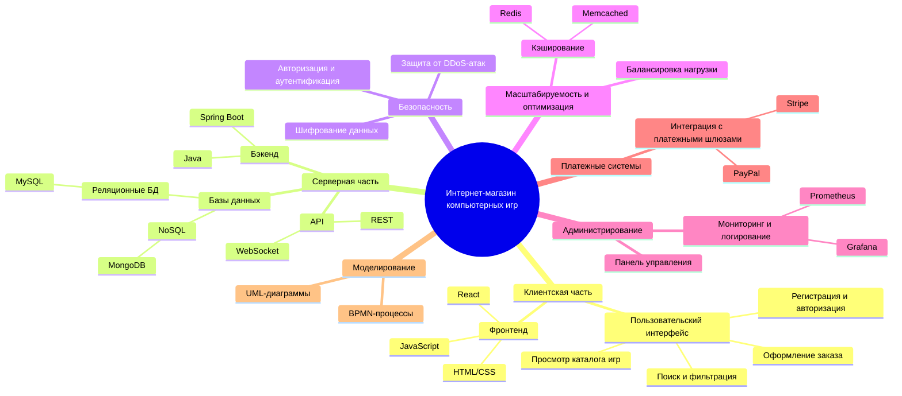
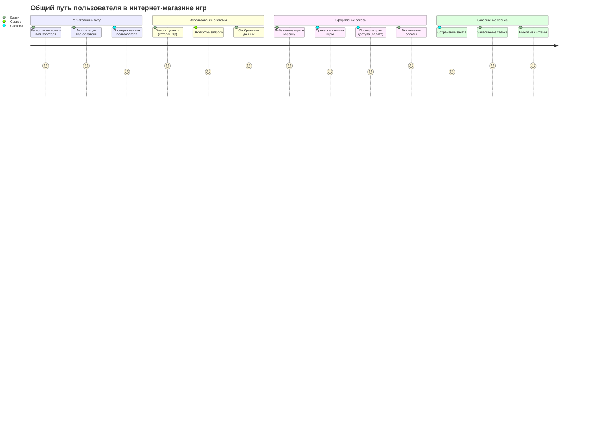
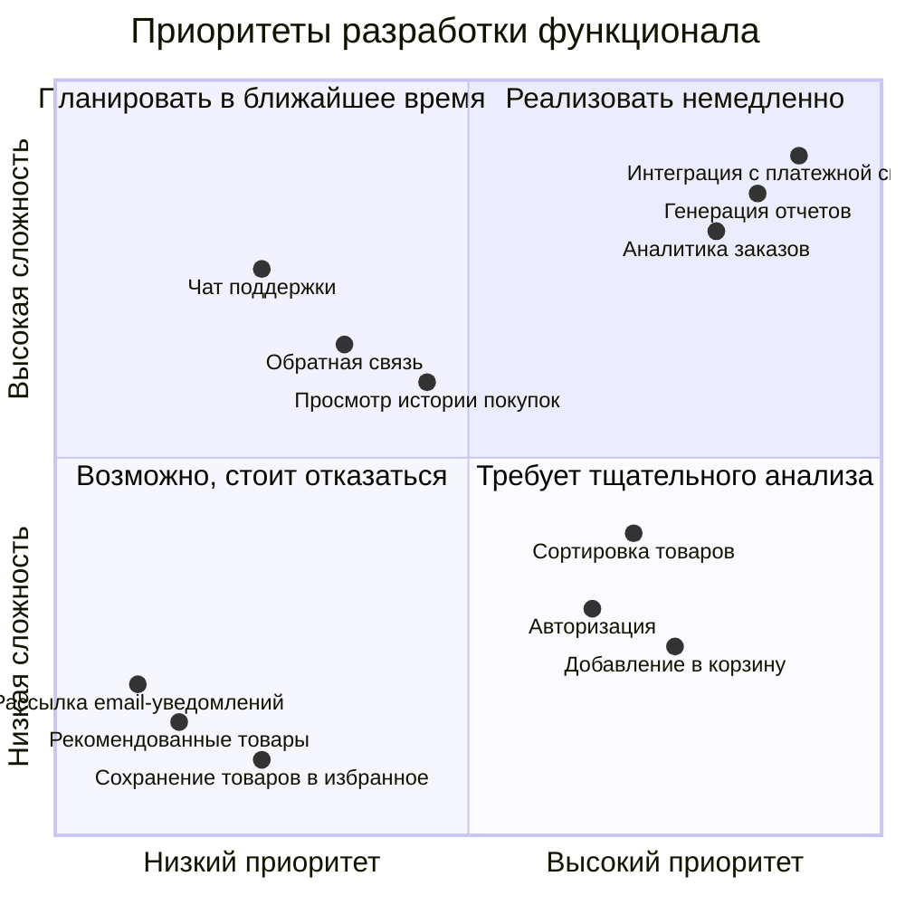
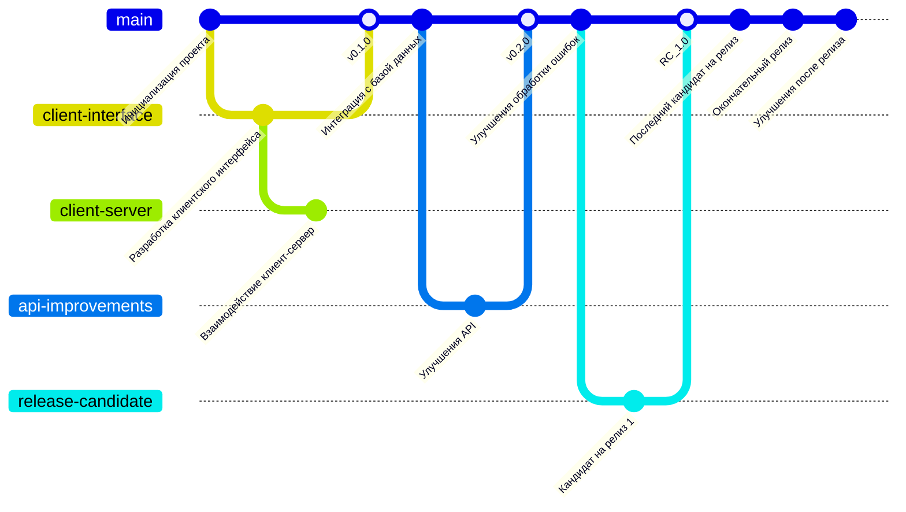

# Интернет-магазин компьютерных игр "oKeyPlay"
Этот проект представляет клиент-серверную систему, включая взаимодействие между клиентом, API и сервером.

## Структура функциональных возможностей (Mind Map)

### Пояснение диаграммы

— Клиентская часть: 
&nbsp;&nbsp;&nbsp;&nbsp;o	основное внимание уделено фронтенду, который использует современные технологии, такие как JavaScript, React, и обеспечивает интуитивно понятный пользовательский интерфейс для регистрации, поиска и оформления заказа. 
—	Серверная часть: 
&nbsp;&nbsp;&nbsp;&nbsp;o	бэкенд реализован на Java с использованием Spring Boot. Базы данных включают MySQL (реляционная) и MongoDB (NoSQL) для гибкости хранения; 
&nbsp;&nbsp;&nbsp;&nbsp;o	API поддерживает REST и WebSocket для различных типов взаимодействий. 
—	Безопасность: 
&nbsp;&nbsp;&nbsp;&nbsp;o	включает шифрование данных, авторизацию и аутентификацию и защиту от DDoS-атак для защиты пользовательских данных и обеспечения стабильной работы. 
—	Масштабируемость и оптимизация: 
&nbsp;&nbsp;&nbsp;&nbsp;o	используется балансировка нагрузки и кэширование с Redis и Memcached для повышения производительности и устойчивости. 
—	Администрирование: 
&nbsp;&nbsp;&nbsp;&nbsp;o	панель управления обеспечивает управление магазином, а мониторинг и логирование с помощью Grafana и Prometheus отслеживают состояние системы. 
—	Платежные системы: 
&nbsp;&nbsp;&nbsp;&nbsp;o	поддерживается интеграция с популярными платежными шлюзами, такими как PayPal и Stripe, для удобства оплаты. 
—	Моделирование: 
&nbsp;&nbsp;&nbsp;&nbsp;o	используются UML и BPMN для проектирования и документирования процессов системы. 

## Диаграмма путешествия пользователя (User Journey Diagram)

### Пояснение диаграммы

—	Регистрация и вход: 
&nbsp;&nbsp;&nbsp;&nbsp;o	пользователь сначала регистрируется и входит в систему. Система проверяет корректность введенных данных. 
—	Использование системы: 
&nbsp;&nbsp;&nbsp;&nbsp;o	пользователь запрашивает каталог игр, сервер обрабатывает запрос и отправляет данные для отображения на клиентской стороне. 
—	Оформление заказа: 
&nbsp;&nbsp;&nbsp;&nbsp;o	пользователь добавляет игру в корзину. Система проверяет доступность игры и права на выполнение платежа, после чего пользователь завершает оплату. 
—	Завершение сеанса: 
&nbsp;&nbsp;&nbsp;&nbsp;o	система сохраняет информацию о заказе. Пользователь завершает сеанс и выходит из учетной записи. 

## Диаграмма «квадрант-граф»

### Пояснение диаграммы

Оси: 
—	по оси X (горизонталь): приоритет задачи (от низкого к высокому); 
—	по оси Y (вертикаль): сложность задачи (от низкой к высокой). 
Квадранты: 
—	Реализовать немедленно (верхний правый): 
&nbsp;&nbsp;&nbsp;&nbsp;o	функции, которые необходимо внедрить в кратчайшие сроки: генерация отчетов, аналитика заказов, интеграция с платежной системой. 
—	Планировать в ближайшее время (верхний левый): 
&nbsp;&nbsp;&nbsp;&nbsp;o	функции с высоким приоритетом, но требующие значительных усилий: чат поддержки, обратная связь, просмотр истории покупок. 
—	Требует тщательного анализа (нижний правый): 
&nbsp;&nbsp;&nbsp;&nbsp;o	функции, которые могут потребовать дополнительного анализа их полезности: авторизация, сортировка товаров, добавление в корзину. 
—	Возможно, стоит отказаться (нижний левый): 
&nbsp;&nbsp;&nbsp;&nbsp;o	функции с низким приоритетом и низкой сложностью, которые не несут значительной пользы: рекомендованные товары, рассылка email-уведомлений, сохранение товаров в избранное. 

## Диаграмма Gitgraph

### Пояснение диаграммы

Основная ветка (main): 
—	содержит ключевые этапы разработки проекта; 
—	начинается с «Инициализация проекта». 
Ветвление: 
—	client-interface: Ветка для разработки клиентского интерфейса; 
—	client-server: Ветка для реализации взаимодействия клиент-сервер; 
—	api-improvements: Ветка для улучшения API. 
Слияния: 
—	ветка client-interface объединяется в main на этапе версии v0.1.0; 
—	ветка api-improvements объединяется в main на этапе версии v0.2.0. 
Релизы: 
—	RC_1.0 (Кандидат на релиз 1) — первая кандидатная версия; 
—	RC_2.0 — вторая версия кандидата; 
—	v1.0.0 — финальный релиз; 
—	v1.1.0 — пост-релизные улучшения. 
Теги: 
—	теги обозначают версии релизов, чтобы их можно было легко идентифицировать. 
